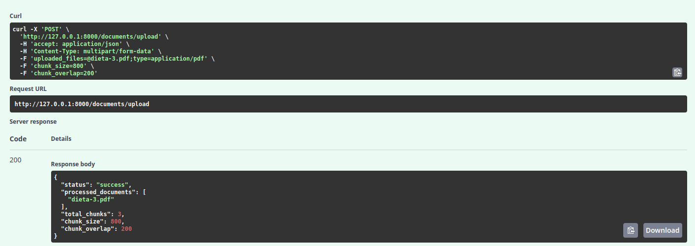
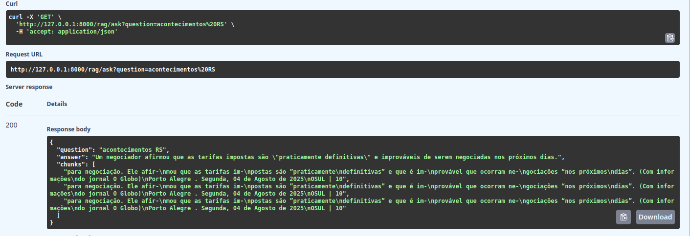
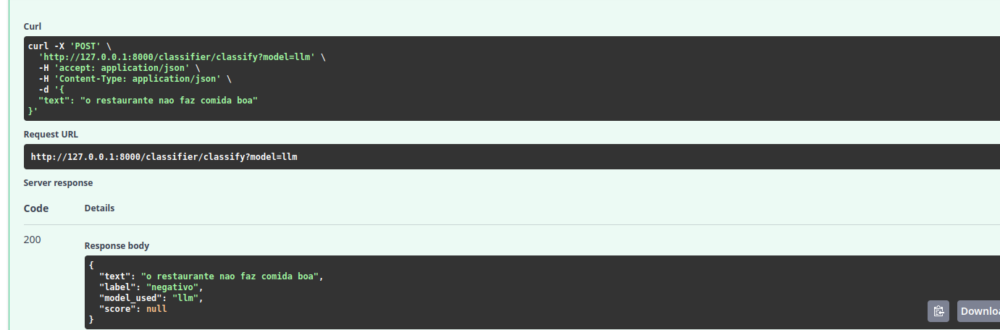

# Contextual AI – MVP (Desafio CGU)

### Introdução

A API resolve três desafios:

1. **Processamento de PDFs**  
   (upload → chunk → embedding → armazenamento vetorial)  
2. **Perguntas via RAG**  
3. **Classificação de sentimento**

A solução roda **localmente em CPU**, mas foi arquitetada para crescer até  
**10 000 usuários concorrentes**.

---

## 1. Decisões técnicas

| Camada              | Escolha                                      | Motivo                                                                                             |
|---------------------|----------------------------------------------|-----------------------------------------------------------------------------------------------------|
| **Embeddings**      | `mxbai-embed-large` via **LangChain + Ollama** | Multilingue, rápido em CPU; disponível via `ollama pull mxbai-embed-large`             |
| **LLM / SLM**       | `gemma3:4b` (Google Gemini tech)              | 4 B parâmetros, janela 128 k, cobre 140+ idiomas, < 300 ms em CPU; `ollama pull gemma3:4b`           |
| **Banco vetorial**  | **ChromaDB** (SQLite + Faiss)                 | Persistência em disco, zero-ops, integração direta com LangChain                                    |
| **API**             | **FastAPI + Uvicorn**                        | Tipagem, documentação automática (OpenAPI)                                                         |
| **Orquestração**    | **LangChain**                                | Splitter, retriever e chains prontos; facilita troca de peças                                       |

---

## 2. Endpoints

| Método | Rota                       | Descrição                                                       | Parâmetros principais                              |
|--------|--------------------------- |---------------------------------------------------------------- |----------------------------------------------------|
| POST   | `/documents/upload`        | Upload 1..N PDFs → chunk → embeddings → Chroma                  | `chunk_size` (800) • `chunk_overlap` (200)          |
| GET    | `/rag/ask`                 | Pergunta respondida via RAG (Gemma 3 + Chroma)                  | `question`                                          |
| POST   | `/classifier/classify`     | Sentimento (Gemma 3 ou DistilBERT)                              | body `{ "text": "..." }` • `?model=llm` / `hf`      |

---

## 3. Arquitetura de alto nível

```
┌──────────────┐     ┌───────────────────┐
│    Usuário   │───► │  Load Balancer    │───┐
└──────────────┘     └───────────────────┘   │
                                             │
            ┌──────────────────────┐         │
            │ FastAPI Pod (RAG)    │◄────────┤ (HTTP)  
            └──────────────────────┘         │
            ┌──────────────────────┐         │
            │ FastAPI Pod (upload) │─┐       │
            └──────────────────────┘ │       │
                                     │       │
                                     │       ▼
                                     │  ┌──────────┐
                                     ├─▶│ RabbitMQ │
                                     │  └────┬─────┘
                                     │       │
                                     │  ┌──────────┐
                                     │  │ Workers  │  (Celery)
                                     │  └────┬─────┘
                                     │       │ chunks + metadados
                                     ▼       │
                              ┌────────────────────┐
                              │  ChromaDB          │
                              └────────┬───────────┘
                                       │ embeddings
                                       ▼
                              ┌────────────────────┐
                              │  Ollama daemon     │
                              │ gemma3 / mxbai     │
                              └────────────────────┘
```

**Escalabilidade** Pods stateless escalam horizontalmente (HPA);  
**Performance** Chroma + Faiss ~10 ms; Gemma3 4B CPU ~250 ms;  
**Disponibilidade** ≥ 2 pods e LB; Chroma persiste em PVC;  
**Segurança** Upload filtrado, antivírus side-car, HTTPS, rate-limit.

---

## 4. Execução local

```bash
ollama pull gemma3:4b
ollama pull mxbai-embed-large
uvicorn main:app --reload         # Swagger em http://127.0.0.1:8000/docs
```

---

## 5. Estrutura de diretórios resumida

```
contextual_ai/
├─ main.py
├─ src/
│  └─ documents_processing.py
├─ routes/
│  ├─ documents.py
│  ├─ rag.py
│  └─ classifier.py
├─ infra/
│  ├─ services/
│  │   ├─ embedding_service.py
│  │   ├─ llm_service.py
│  │   └─ classifier_wrapper.py
│  └─ repositories/
│      ├─ chroma_repository.py
│      └─ __init__.py
├─ data/docs/            # PDFs 

```

---


### Exemplos 

<div style="display:flex; gap:32px; justify-content:center; margin-top:54px">
  
  
</div>

<div style="text-align:center; margin-top:52px">
  
</div>
